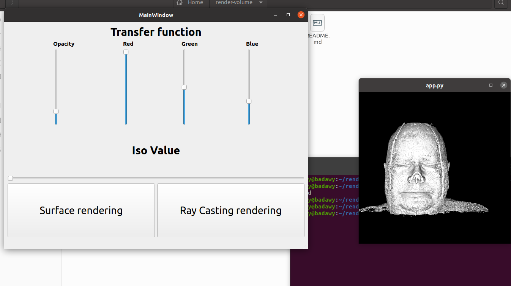

## Part 2
------------
#### volume rendering app with VTK & Qt

* GUI had been created using `pyqt5` and `Qt Creator`


* The user can upload an folder using function `open_file`
```
def open_file(self , type):
self.dataDir= QtWidgets.QFileDialog.getExistingDirectory(self, "Select Directory")

if self.dataDir:
    if type:
        casting_rendering(self.dataDir, self.opacity)
    else:
        surface_rendering(self.dataDir)
```

* The surface rendring is done using function `surface_rendering`
```
def surface_rendering(dataDir):
    renWin = iren_surface.GetRenderWindow()
    aRenderer = vtk.vtkRenderer()
    renWin.AddRenderer(aRenderer)

    
    # Read Dataset using vtkDICOMImageReader
     
    v = vtk.vtkDICOMImageReader()
    v.SetDataByteOrderToLittleEndian()
    v.SetDirectoryName(dataDir)
    v.SetDataSpacing(3.2, 3.2, 1.5)
    
    # An isosurface, or contour value of 500 is known to correspond to the
    surfaceExtractor.SetInputConnection(v.GetOutputPort())
    surfaceExtractor.SetValue(0, 500)
    surfaceNormals = vtk.vtkPolyDataNormals()
    surfaceNormals.SetInputConnection(surfaceExtractor.GetOutputPort())
    surfaceNormals.SetFeatureAngle(60.0)
    surfaceMapper = vtk.vtkPolyDataMapper()
    surfaceMapper.SetInputConnection(surfaceNormals.GetOutputPort())
    surfaceMapper.ScalarVisibilityOff()
    surface = vtk.vtkActor()
    surface.SetMapper(surfaceMapper)
    
    aCamera = vtk.vtkCamera()
    aCamera.SetViewUp(0, 0, -1)
    aCamera.SetPosition(0, 1, 0)
    aCamera.SetFocalPoint(0, 0, 0)
    aCamera.ComputeViewPlaneNormal()
    
    aRenderer.AddActor(surface)
    aRenderer.SetActiveCamera(aCamera)
    aRenderer.ResetCamera()
    
    aRenderer.SetBackground(0, 0, 0)
    
    aRenderer.ResetCameraClippingRange()
    
    # Interact with the data.
    iren_surface.Initialize()
    renWin.Render()
    iren_surface.Start()
    iren_surface.show()    

```


* Iso values of surface rendring is adjustable using sliders
```
surfaceExtractor = vtk.vtkContourFilter()
def iso_slider(val):
    surfaceExtractor.SetValue(0, val)
    iren_surface.update()
```


* The Ray casting rendring is done using function `casting_rendering`
```
def casting_rendering(dataDir , opacity):
    ren = vtk.vtkRenderer()
    renWin = vtk.vtkRenderWindow()
    renWin.AddRenderer(ren)
    iren_casting.SetRenderWindow(renWin)
    # Read Dataset using vtkDICOMImageReader
    v = vtk.vtkDICOMImageReader()
    v.SetDataByteOrderToLittleEndian()
    v.SetDirectoryName(dataDir)
    v.SetDataSpacing(3.2, 3.2, 1.5)

    volumeMapper = vtk.vtkGPUVolumeRayCastMapper()
    volumeMapper.SetInputConnection(v.GetOutputPort())
    volumeMapper.SetBlendModeToComposite()

    volumeColor = vtk.vtkColorTransferFunction()
    volumeColor.AddRGBPoint(0,    0.0, 0.0, 0.0)
    volumeColor.AddRGBPoint(500,  opacity[2], opacity[1], opacity[0])
    volumeColor.AddRGBPoint(1000, 1.0, 0.5, 0.3)
    volumeColor.AddRGBPoint(1150, 1.0, 1.0, 0.9)


    # The opacity transfer function is used to control the opacity
    # of different tissue types.
    volumeScalarOpacity = vtk.vtkPiecewiseFunction()
    volumeScalarOpacity.AddPoint(0,    0)
    volumeScalarOpacity.AddPoint(500,  opacity[3])
    volumeScalarOpacity.AddPoint(1000, 0.15)
    volumeScalarOpacity.AddPoint(1150, 0.85)

    volumeGradientOpacity = vtk.vtkPiecewiseFunction()
    volumeGradientOpacity.AddPoint(0,   0.0)
    volumeGradientOpacity.AddPoint(90,  0.5)
    volumeGradientOpacity.AddPoint(100, 1.0)

    volumeProperty = vtk.vtkVolumeProperty()
    volumeProperty.SetColor(volumeColor)
    volumeProperty.SetScalarOpacity(volumeScalarOpacity)
    volumeProperty.SetGradientOpacity(volumeGradientOpacity)
    volumeProperty.SetInterpolationTypeToLinear()
    volumeProperty.ShadeOn()
    volumeProperty.SetAmbient(0.4)
    volumeProperty.SetDiffuse(0.6)
    volumeProperty.SetSpecular(0.2)

    volume = vtk.vtkVolume()
    volume.SetMapper(volumeMapper)
    volume.SetProperty(volumeProperty)

    ren.AddViewProp(volume)
    camera =  ren.GetActiveCamera()
    c = volume.GetCenter()
    camera.SetFocalPoint(c[0], c[1], c[2])
    camera.SetPosition(c[0] + 400, c[1], c[2])
    camera.SetViewUp(0, 0, -1)

    renWin.SetSize(640, 480)

    # Interact with the data.
    iren_casting.Initialize()
    renWin.Render()
    iren_casting.Start()
```


* The user can adjust the opacity and the RGB color of the Casting ray rendering using sliders by function `opacity_slider`
```
def opacity_slider(self):
        self.opacity = [self.verticalSlider.value()/100.0 , self.verticalSlider_2.value()/100.0 , self.verticalSlider_3.value()/100.0 , self.verticalSlider_4.value()/100.0]
        if self.dataDir:
            casting_rendering(self.dataDir , self.opacity)
```


